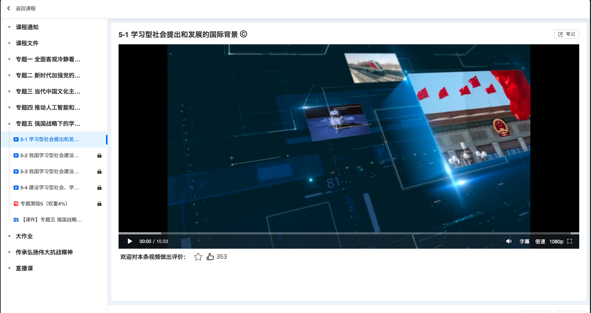
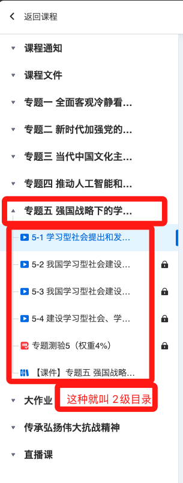
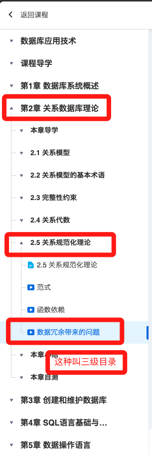
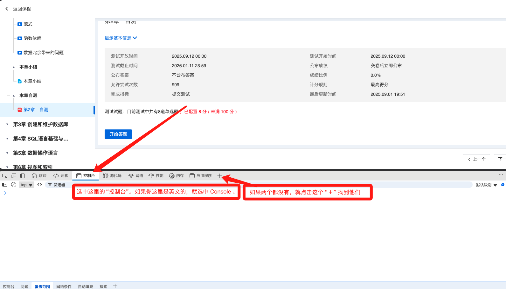
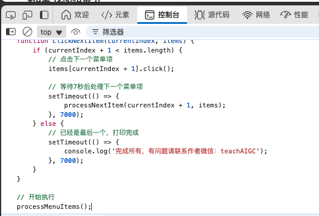

说明： 该项目是辅助开放大学上课的项目，主要功能是替代我自己上课和学习，比如打开视频课程，打开其他课程等等。
使用声明： 本软件仅供学习使用，请勿用于商业用途。

## 有问题请联系作者微信：teachAIGC

首先放一个完整的视频，展示一下效果：地址：https://www.bilibili.com/video/BV1aK4wz3EGM/?vd_source=040ae50bcee1b8e8f33e26316e5fcec8

[使用方法](https://www.bilibili.com/video/BV1aK4wz3EGM/?vd_source=040ae50bcee1b8e8f33e26316e5fcec8)

## 使用方法：
- 我们需要自己登录到开放大学，并打开对应的课程页面如下图所示：

- 我们需要判断当前的课程的目录是2级目录还是3级目录，如下图所示：

- 我们点击我们还没有上的课程
- 按键F12，打开控制台，如下图所示：

- 然后我们根据当前的目录是2级还是3级，将对应的js文件的内容全部复制，并粘贴到 控制台（Console）中，如下图所示：

- 在控制台回车，脚本就会自动运行了

## 注意事项
1. 脚本仅限电脑使用，手机不可使用。
2. 脚本只会自动帮你上完当前章节下的所有小节和课程，不会自动跳转到下一章，你需要手动点击下一章的第一个课程，然后重新运行脚本
3. 脚本不会帮你做练习题，快速做练习题的方式是，首先你在浏览器装一个豆包插件并登录，然后点击豆包插件，会在右边有一个侧边栏。然后你点击左边的“开始答题”进入到答题页面后，全选所有文案，会看到右侧的豆包显示两个按钮“解释”和“翻译”，就点击“解释”按钮，豆包就会把答案给到你，你就去答题就好了，正确率很高，但不保证每次都是100%。
4. 视频的播放速度可以调整，有需要提高速度的，联系我微信：teachAIGC，最高支持4倍速（高于4倍无效了）
5. 脚本开始运行后，不可以关闭页面，不可以最小化，电脑不可以锁屏；可以打开其他的应用（如微信，QQ等）或者切换到其他的页面（如新开一个浏览器窗口或者新开一个浏览器标签页）。比如我吧，我就是一边开着脚本自动上课，一边玩LOL，一把LOL打完出来，有时候一章就完成了，我就点击下一章开始继续上课。
6. 有问题请联系作者微信：teachAIGC